@TStupariu sa-ti activezi grammar corrector. am vazut prin mai multe locuri typos gen ling in loc de long, intermidiate in loc de intermediate
@TStupariu editul asta-l scriu cand am ajuns cam la 30%. Am impresia ca folosesti virgula de foarte multe ori. In Engleza sunt putine si restranse locurile unde se folosesc, mult mai putine comparat cu romana. O sa vezi pe commit cateva locuri unde am scos virgulele in plus.

BABES-BOLYAI UNIVERSITY CLUJ-NAPOCA

FACULTY OF MATHEMATICS AND COMPUTER SCIENCE

COMPUTER SCIENCE, ENGLISH

DIPLOMA THESIS

Virtual Boards and Server-less Streaming

Supervisor:

Bogdan Pop

Author:

Tudor Filip Stupariu

2018

---

# Abstract

This paper presents a concept platform that allows its users to create different rooms, public or private, and create content via graphics and text. Next, the content is transmitted in real time to other users via a video stream capturing the graphics being drawn. The platform also allows for users to comment in real time using a chat system. The platform consists of a web application based on an API created in Ruby on Rails and a front-end client based on VueJS.

This paper is structured as follows. Chapter 1 provides an introduction, the motive behind creating this application and why this solution is needed. Chapter 2 presents a thorough analysis of ~~some current~~ possible solutions to the problem described in Chapter 1~~, and analyses their issues and faults~~. Chapter 3 goes through the main solutions introduced by the application and why they are superior to current solutions. Chapter 4 presents the application ~~in details, both~~ from a theoretical aspect and from a practical aspect~~,~~ while providing samples of code throughout. Chapter 5 brings a conclusion and a short summary of the solution presented while Chapter 6 contains the bibliography and inspiration used for the paper.
@TStupariu de corectat mai sus modificarile.

# Contents

1. Introduction

   1.1 Problem definition

   	1.2 Web based graphics and server-less streaming

   	1.3 General description and personal contribution

2. Current Theoretical Approaches

   2.1 Graphics and virtual boards

   	2.2 Streaming approaches

   	2.3 Problems with current solutions

   	2.4 Solution to the problems

3. Benefits of proposed solution

4. Application details

   4.1 Functionalities

   	4.2 Design

   		4.2.1 Backend Server

   		4.2.2 Database

   		4.2.3 Streaming Solution

   		4.2.4 Web Graphics

   		4.2.5 Serverless Computing

   		4.2.6 UI and Front-end

   	4.3 Implementation

   		4.3.1 Backend Server

   		4.3.2 Database

   		4.3.3 Streaming Solution

   		4.3.4 Web Graphics

   		4.3.5 Serverless Computing

   		4.3.6 UI and Front-end

   	4.4 Validation and Testing

   	4.5 Personal Contribution

5. Conclusion

6. Bibliography

# 1. Introduction

This chapter is aimed at providing a short inside of the problem this platform is trying to solve and how/why it's doing things the way it currently is implemented.

This paper is structured as follows. Chapter 1 provides an introduction, the motive behind creating this application and why this solution is needed. Chapter 2 presents some current possible solutions to the problem described in Chapter 1, and analyses their issues and faults. Chapter 3 goes through the main solutions introduced by the application and why they are superior to current solutions. Chapter 4 presents the application in details, both from a theoretical aspect and from a practical aspect, also providing samples of code throughout. Chapter 5 brings a conclusion and a short summary of the solution presented, while Chapter 6 contains the bibliography and inspiration used for the paper.

## 1.1 Problem Definition

Collaboration and remote teaching tools have existed for a long time, but they have always been platform dependent or hard to use. [@TStupariu adresarea ar trebuie sa fie impersonala. In loc de "A lot of what **we're**" ai putea rescrie gen: Nowadays, internet plays an intrinsic/central part of a person's daily routine, so it is just a matter...] A lot of what we're doing on a day to day basis is on the internet, so it was just a matter of time until collaboration tools would go to a web only approach. The problem of drawing graphics on the web has always existed and different solutions have been available for some time now. One of the most popular ones, ~~have been around like~~ Adobe Flash, was not always reliable and ~~lately they have been lacking support~~ has received limited support and development in recent years. Since the introduction of HTML5, a new element was added called "canvas" and along with it an API you can interact with using JavaScript.
[@TStupariu ar trebui sa pui referinte la claimurile astea. gen lack of support, poti inclusiv articole in care Apple spune ca nu o sa suporte veci flash pentru ca e security risk si consuma f multe resurse, si chiar poti dezvolta un paragraf extra pe tema asta, si mai ai juma de pagina]

Another problem has been streaming while keeping costs down. Big platforms like Twitch have been doing it using intermediate servers to handle the stream data and distribution, but for small groups of people this is a really costly solution, since the processing power required by the servers in incredibly high. [@TStupariu si aici ar merge citare, eventual mai multe exemple]

Combining the two, remote learning and teaching has always been a bit of a challenge, and this platform aims to make it easy to use and integrate seamlessly in the day-to-day life of its users, while also providing enough tools for someone to manage to be productive using the app.

## 1.2 Web Based Graphics and Serverless Streaming

Drawing graphics on the web isn't really a challenge anymore, the problem comes when you have to add user interaction. Just displaying shapes has always been decently easy, but making a user dynamically draw shapes is not the easiest of tasks. Further more [@TStupariu Also e mai scurt decat further more / moreover, si nu e la fel de scientific :)) ... daca pui variante mai lungi in toata licenta, mai prinzi si cateva randuri, poate o pagina in plus], former solutions involved plugins [@TStupariu poti mentiona plugins, eventual un screenshot cu dificultati de instalare etc, poti duce chiar la extrem cu un screenshot cu un browser plin de toolbars de acu cativa ani buni cand lumea tot dadea install install install si apoi nu mai mergea nimic] which some users may not have installed or it may confuse a user about why the platform does not seem to work. This solution provides a general solution using a standard provided by HTML itself.

[@TStupariu cred ca e mai bine sa folosesti peer-to-peer / P2P, atat in text cat si in title la capitol / subcapitol ] Serverless streaming, or peer-to-peer streaming is also a new idea on the web. P2P file transfers have existed for a long time, but just recently there has been introduced a standard for managing such connections that also support data, video and audio streams in the form of WebRTC P2P streaming. This is a standard/API that can easily be accessed by JavaScript on the web, providing a general solution for any user on any platform, without requiring extra plugins or intermediate servers ti handle the data, which might introduce more latency in the stream feed.

[@TStupariu pun aici ca e in context, dar chestia asta o poti dezvolta intrun subcapitol la final, future directions sau ceva de genul asta, unde folosind tehnologiile din licenta, combinat cu Electron https://electronjs.org poti oferi solutia ca aplicatie desktop pe Windows / Linux / Mac]

## 1.3 General Description and Personal Contribution

This application provides a simple to use web client accessible by any user through a web browser. It provides authentication in order to keep the platform secure, and allows the user to create both public and password protected private groups. Once in a group, the initiator can start the stream, while the other attendees can start watching a video feed. The initiator has a canvas on which he can freely draw graphics, text, images and shaped and that information is transmitted live through the video feed. It also provides a form of live interaction through a chat, so that the attendees can freely ask questions or leave comments.

I have personally developed the API for the web client and implemented the authentication, database structure and back-end logic. Also, I created the web client and layout of the interface. The logic behind signalling peers and live chat has been implemented from scratch, as well as all the tools for drawing on the canvas combined with the user interaction with these tools.
@TStupariu aici la personal contributions e cam singurul loc unde poti folosi adresari personale.

# 2. Current Theoretical Approaches

@TStupariu Exista doar concepte teoretice sau si solutii practice? Daca exista si parte practica ar merita un subcapitol in 2.

This chapter describes the most used current approaches to the problem. It also goes a little bit into each approach and its downsides for ~~our nu prea merge, ca esti doar tu~~ the goal of achieving a low cost and easy to use streaming and drawing learning platform.

## 2.1 Graphics and virtual boards

Currently there are multiple other approaches for drawing on a blank canvas on the web without the need for native clients. Some of these include SVG graphics and Flash drawing.

SVG graphics work pretty well performance-wise. Moreover, since they are vector graphics they scale really well. The problem is that graphics display is not the only requirement. Allowing users to create them is also extremely important. Such advanced SVG tooling is trickier at best. The handling of shapes, text or other types of primitive graphics is harder to implement and doesn't make too much sense in a SVG environment.

Flash could be a viable option, but it is an old technology that has started to lack support in the recent years. First and foremost, users do need a plugin for running flash applications which makes it much less user friendly. Secondly, Flash's developer, Adobe, responsible for building, maintaining and supporting the technology has released statements that Flash support will be dropped by the year 2020 [https://support.google.com/chrome/answer/6258784?co=GENIE.Platform%3DDesktop&hl=en].
@TStupariu linkul de mai sus nu e bun ca referinta. E gen stack overflow sau wikipedia. daca intri pe link, dai de altul: https://www.blog.google/products/chrome/saying-goodbye-flash-chrome/ si apoi dai de alt link: https://blogs.adobe.com/conversations/2017/07/adobe-flash-update.html Noah asta ultimul e referinta calumea. Din referinte dinastea poti lua si bucati de text, reformula etc sa pui mai detaliat explicatii in licenta...

## 2.2 Streaming Approaches

Streaming in general is an action that requires a lot of resources, both computational and network ones. Traditionally, streaming has been done through standalone servers user exactly for that purpose. While they do produce decent scalability for a big number of concurrent users trying to watch a stream they also introduce a couple problems with the main one being high costs. The server cost is highest since it is a resource hungry activity. Therefore maintenance and scalability can be quite costly. Further more, since this application is made for small rooms of people it will not directly benefit from the ability to handle a great amount of users watching a stream at the same time.

## 2.3 Problems with current solutions

Current solutions are either too old, cumbersome or expensive to implement and maintain. Server resources are expensive, and the more processing that can be done on the client, the cheaper the maintenance cost of the application will be. Having more servers and nodes that a stream has to pass through can also introduce more latency long the line. ~~Also replace :)~~, making the user interaction as straight-forward as possible is not so easy using these technologies.

## 2.4 Solutions to the problems

Each problem has a solution. Graphics are the starting point. The release of HTML5 has brought a new element: canvas with an API that allows advanced programming. It offers developers an editable area that does not rely on a DOM for creating graphics. It also needs no other external tool or extension. The interaction and drawing rely solely on the browser's Javascript engine. Its main advantages are ease of use and the effortless user interaction it can provide. ~~Also synonym here~~ this API offers an easy way to capture a video stream of the actions and graphics being drawn.

For the streaming part, the solution for expensive server resources is eliminating servers all together. WebRTC P2P video streaming is a technology optimised for streaming data, including video, between multiple peers directly. This way, the system only needs a server for signalling clients when a connection offer is coming, but no actual video stream data passes through it. The connection for the video stream is made directly between the 2 clients' browsers, minimising the server resources needed.

# 3. Benefits of proposed solution

This chapter a few of the benefits introduced by the proposed solution that help solve the problems mentioned before.

First of all, the server API is made with technologies which are really fast to develop and implement. Ruby on Rails is a really good environment for developing applications quickly without too much hustle. Second, the JavaScript library used is VueJS, which provides huge amounts of ~~customizability not a word, reword the sentence ~~ and speed, rendering only the parts it needs in a single page application form. Firebase allows for easy communication using sockets and the canvas and WebRTC protocols allow for a cross-platform solution that works in all browsers from desktop to mobile platforms allowing all types of users to watch video streams.

# 4. Application Details

This chapter goes in depth into describing the applications and all the core components that make the while platform work the way it should.

## 4.1 Functionalities

This first thing a user sees when going onto the platform is a login screen where he can create/sign into an already existing account. This is the only way to use the platform and confirm his identity, through a secure authentication form.

Next, a user has 2 options. Either browse the already existing rooms, or create his own. In case he wants to create one, there's a simple form where he has to input some details, and if he wants to make a private room, he also has to set a password. Afterwards, he will be redirected to that specific room's page. In case he wants to join an existing room, he has to browse to his preferred one, and click to join. If the room is private, he'll be required to input the password corresponding to that room.

Afterwards, if he is the creator, he'll be able to go to the actual creation page, where he'll have the canvas and a chat. If he's an attendee, he'll be redirected to the view page containing the stream video and the chat.

As an owner, the canvas will have several tools, from shape drawing to image insertion and text. As a viewer, you'll have your basic video controls like play/pause.

All parties have unlimited access to the chat which runs along in real time with the stream, allowing seamless interaction.

## 4.2 Design

This sub chapter describes the theoretical aspects and the tools used for creating the application.

### 4.2.1 Backend Server

The language used for handling all the back-end logic is Ruby, in conjunction with the Rails framework. It works as a stand alone API, allowing for future integration with mobile, desktop or any other type of client. Ruby is a dynamic, interpreted, reflective, object-oriented programming language designed and developed in the 1990s. While it can work as a standalone programming language, it's popularity has really grown with the rise of Rails, a framework for easy and rapid development of web applications. The current iteration of Ruby used in this project is Ruby 2.3.3, while Rails' version is 5.1.4 . Rails is a server-side web application framework that uses a general MVC pattern for data transmission.

The way Ruby on Rails uses MVC in this project is as follows: The model properties are being defined in migrations, while different limitations and validations on those properties are done into their own file. Using these models that automatically map to the tables in the database using the Active Record pattern, the controller receives all inbound HTTP requests and handles the data, later returning that data to the view in JSON format.

One advantage and feature that makes Ruby on Rails stand out from other frameworks and helps in creating a really agile development environment is its convention over configuration philosophy. This is a software design paradigm that aims to reduce the amount of tedious decisions a developer has to take in order to increase the time allocated for developing actually important features. This way, a lot of things like views, controllers and models are't tied together using import statements, dependency injection or other techniques. Instead, their are connected through naming conventions. These conventions will speed up development, keep the code concise and readable and, most important, these conventions allow you an easy navigation inside your application.

[Convention over Configuration]: https://rubyonrails.org/doctrine/#convention-over-configuration	"Deisgn Choices - David Heinemeier Hansson"

> Not only does the transfer of configuration to convention free us from deliberation, it also provides a lush field to grow deeper abstractions. If we can depend on a Person class mapping to people table, we can use that same inflection to map an association declared as has_many :people to look for a Person class. The power of good conventions is that they pay dividends across a wide spectrum of use.
>
> But beyond the productivity gains for experts, conventions also lower the barriers of entry for beginners. There are so many conventions in Rails that a beginner doesn’t even need to know about, but can just benefit from in ignorance. It’s possible to create great applications without knowing why everything is the way it is.

The mapping between the controller actions and the HTTP requests is done using a routing module that redirects every inbound request to its corresponding controller method. This application uses a combination of GET and POST requests in order to handle all CRUD (Create-Read-Update-Delete) operations.

Authentication is another point being handled by the server. The application uses a gem called devise-jwt, allowing for easy authentication using JSON Web Tokens. This provides a really adaptable authentication scheme, being able to wokr on the web, mobile, desktop, and virtually any platform a client would be on. The passwords are hashed and salted when stored in the database, so that at no time the application knows the actual credentials of a user. This module also allows for future expansion, supporting social media authentication using Google, Facebook or other providers.

The transfer of data from the server is done through views which contain JSON strings. These strings are rendered using a gem called Jbuilder. Jbuilder gives a user a simple DSL for declaring JSON structures, coming in handy especially in places where you are working with big and complicated data structures. It can loop through your structure and create a dynamic model for transmitting the data.

This being an API, it has to be able to support CORS (Cross-Origin Resource Sharing). Without it, a web app could not work in browsers like chrome, since the server and the client would not be on the same server. The gem rack-cors allows you to easily enable this functionality through header alteration, while also making it easy to restrict to certain domains.

### 4.2.2 Database

The application currently uses a simple file-based database called SQLite. It is ideal for development, since setup takes virtually no time at all, especially since Rails uses it as a default database. SQLite is a relational database management system contained in the C language. It being embedded in the application itself, without the need of a server has both advantages and disadvantages. The bad part is that the size of it can grow quickly and can become a burden for your back-end server. On the bright side, it is really portable, easy to setup and makes for a great tool during the development process.

One big advantage of Rails is that it makes it painless to migrate to another relational database system. It uses an abstraction layer over your database so that you never have to manually write SQL queries or modify tables. If you decide to switch to another database system like PostgreSQL you simply have to modify a couple configuration files. The abstraction layer is called Active Record and it is based on a pattern carrying the same name. In a nutshell, what it does is it maps every single table to an entity that is globally available throughout the application controllers, this way also removing the need for separate repositories.

Another big helper flexibility-wise are ActiveRecord Migrations. They provide a code-first database building workflow which allows you do gradually modify the database and provides an easy way of reverting back to older versions of the database. Also, you do not have to manually migrate databases from computer to computer, making the database creation and seeding just a terminal command away.

### 4.2.3 Streaming Solution

In order for the app to allow a user to stream the content of a canvas it uses a streaming standard called WebRTC. WebRTC is an open source project aimed to provide browsers and mobile applications an easy access to Real Time Communication capabilities via APIs. The part of this technology used by this application is Peer-To-Peer Video Streaming, allowing video streams between users without the data needing to pass through intermediary servers. How it currently works is that the peers are creating a unique id, then using a simple signaling server made for letting peers know about each other it makes the connection between clients and starts the video stream. Current supported platforms include Google Chrome, Firefox, Opera, Android and IOS, but many more browsers seek to adopt it. Also, this technology is optimized for data streams, this way keeping a smaller footprint on your network traffic while keeping the stream quality high.

The application also uses a wrapper over this standard in the form of a JavaScript library called simple-peer. This provides a simpler to use API for communicating between peers and a default server for the peers to get their unique ids. This wrapper supports both data streams and video/voice streams.

### 4.2.4 Web Graphics

A user has to be able to draw things somewhere in order to stream them, and in order to do that it will be using an HTML Canvas element. This element exposes an API that can be interpretted with JavaScript, allowing a user to draw or write on a virtual board.

Rather than using the native API, the application uses a wrapper for drawing certain types of shapes, text or images. FabricJS is a library made for displaying graphics easier on a canvas element. It also allows setting different behaviors of elements like drag and drop or rotation. The difference between this and the lower level API a Canvas element provides is that it abstracts all the elements into an object-oriented style. This way, anything you draw will become a simple JavaScript object with properties, allowing for easier management and drawing of graphics.

While FabricJS does provide a more intuitive way of drawing and manipulation objects in an image, the actual process of defining where to draw items on a canvas has to baa handled separately. Currently it is done using a combination of JavaScript event handlers for figuring out the state of the mouse on a canvas. This way, it can easily detect when a user clicks, drags or holds an element and react accordingly while drawing the shapes. All the mechanics for drawing had to be implemented from scratch since they need to be really customizable dependent on what the drawn item is.

Also, in order to get a stream from the Canvas element, the application uses an HTML5 API called captureVideoStream. This allows you to set a target framerate to capture depending on your internet connection and requirements and pass it onwards to the WebRTC connection in order to be streamed onwards. Also, it combines an audio feed from the microphone, so that users can also hear explanations offered by a teacher.

### 4.2.5 Serverless Computing

Some of the features provided are available using a technology called Firebase. To name them exactly, the Chat and the Signalling Server are both made using the Firebase Real-Time Database. The Firebase Real time Database is a database hosted in the cloud that stores information in JSON format. Being Real-Time, it constantly synchronizes with other connected clients using sockets and event listeners.

For the application chat, this technology is useful since you don't have to implement a socket interface from scratch. Also, all communications are done without using the server, just Firebase. By attaching an event listener to certain nodes of the JSON structure, a client is automatically notified of a change if another client decides to alter the structure of that node or the nodes below.

Firebase also comes into help for peer signaling. In order for 2 clients to connect and establish the stream, they need to first know about each other and accept each other's offers. For this, there is a certain sequence to follow starting from the initiator of the stream, and Firebase allows clients to automatically be notified when an offer or answer is present and react according to that. This eliminates the need for implementing a socket interface or for HTTP polling, making the connection easier and faster.

### 4.2.6 UI and Front-End

The client of the application is web based and uses a library called VueJS, it being an open-source JavaScript framework for building user interfaces. It is a versatile, easy to adapt/integrate and performant library having a really small footprint comparing to other frameworks.

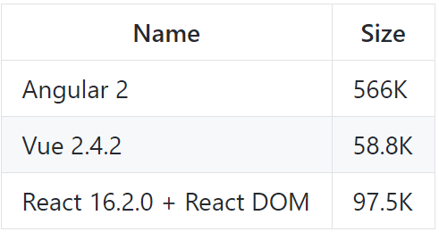

It represents the perfect compromise between big frameworks like Angular 5 that contain every package you want or don't want and small packages like React, while also keeping up and out-performing traditional frameworks. It uses a component based system, allowing for easy re-rendering and communication between different parts of the application.

In order to not have to design every component from scratch the system uses a Material Design based library called Vuetify. Other than providing an intuitive way to customize theming and elements, it also provides a a grid system for designing complicated layouts. It is inspired by the 12-column Bootstrap grid while also having some extra Material Design specific elements. Material Design is a design language and guideline developed in 2014 by Google, expanding on the card based interface that was first introduced in Google Now. It provides a clean and minimalistic look for components while keeping functionality richness and a clean user experience. Also, a great part of Vuetify components is their high reusability, allowing to duplicate elements across different parts of the website while retaining design and behavior.

In order to communicate with the Ruby on Rails server, vBoard uses a JavaScript library called Axios. Its advantage over native APIs such as fetch is that is provides a cleaner interaction and also it supports intercepting requests in order for transformation of attributes like headers. Also, the code used for making an HTTP request is much smaller in size, allowing for a more friendly representation between lines of code.

Another part from where the client gets its data is Firebase. On the web there are currently 2 ways of communicating with a Firebase Real-Time Database, one being using HTTP requests, while the other being using their proprietary SDK. The advantage of the SDK is that is allows for easy subscription to their event listener system, so that updates to the database are automatically transmitted to all clients. Also, Firebase uses a caching system where it caches all the data between requests except for the first one, to allow for faster transfers. The SDK is easy to setup using just a configuration file and it provides a service-like system of interaction.

Since it is developed as a Single Page Application, the usage of a router is required for navigating between pages and components. This is why the app is using the officially supported library for routing called vue-router. It provides a way for dynamically displaying components dependent on the user interaction. Also, different guards can be set on routes so that a user is forced to authenticate before accessing certain parts of the system.

The routing and its guards are based on the HTMl localStorage API. Basically, on every request the client has to include a JSON Web Token in order to validate with the server the identity of the user. Afterwards, as a response, the client is given a different token for every request, this way increasing the security of the application. The system then stores this token in the localStorage of the page.

Despite using Vuetify as a component library, there are times when classic CSS rules have to be applied in a custom manner. For this, instead of using classic CSS which has some limitations like no variables or the fact that rule selectors can become really verbose, the application uses SCSS which then gets interpreted to standard CSS. SCSS provides a syntax for shortening the CSS code you have to write while also providing useful add-ons like variables or mixins. Overall, while it does not add anything to the final user experience, the place where it really shines is in developer satisfaction, since SCSS is much easier to understand rapidly and code complicated selectors and rules.

In order to bundle all the JavaScript files together for usage in the browser, the Vue-CLI (Command Line Interface) comes with WebPack built in, this way not requiring any additional configurations or setups.

There are plenty of external JavaScript packages bundled in the application and, in order to manage them all, a package manager like NPM (Node Package Manager) is used. This way, other than creating an easy way to add packages to a solution, it provides a really simple way of keeping track of all modules and their dependencies and it simplifies the way the code can be migrated from one computer to the other.

##4.3 Implementation

This chapter describes the implementation of all the technologies described above. While the theoretical parts have already been explained, this chapter's goal is to explain how these components are used and how they are tied together to create one cohesive application.

## 4.3 Implementation

This chapter describes how the application makes use of all the technologies presented above in order to make one smooth user experience. It explains how everything is used throughout the application and also how they all tie and communicate together.

### 4.3.1 Backend Server

 A big part of the way Ruby on Rails works is based on the convention over configuration programming paradigm. In this case, you can see that in action using the Profile model, Profile controller and the Profile views set. There are no other imports or necessary dependency injection, the only way Rails knows about all these files is from its naming conventions.

The flow from when an HTTP request comes in and to the point where data is returned to the client is this: The request reaches the routing table where it will be assigned a controller and an action, then it moves on to the actual controller where processing is done, then Rails automatically matches the view corresponging to the action by using the Controller and Action names and returns the data. Let's take the example of an HTTP POST request to "/profile/create". First of all, the routing table finds the first match of the URL string and assigns that specific request the appropriate controller. In this case, if a request is a POST to '/profile/create' it will redirect the processing to the profile controller, at an action called 'create'.

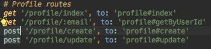

Once it reaches the controller, there is an extra step the application will have to perform before starting processing the data. The before_action tag specifies that each time a request comes in it will have to go through some extra steps. In this case, in order to support authentication and to properly secure the controller, this piece of software has to first check the validity of the JWT token. Devise handles it pretty well, and in this case some exceptions to the validation are in place for the actions 'index' and 'getByUserId', since not all methods of an API have to be private. Basically, a user has the possibility to view all the user profiles or search for a profile based on an ID, but without being properly authenticated he cannot create new users. This way, anyone is allowed read access to this part of the database, but only authenticated users are allowed to perform any modifications.

The next step it does is it matches the name from the routing table to an action in the controller, in this case it being 'create'. The parameters of the request are being accessed using a map called 'params'. Also, the controller doesn't have to explicitly specify what does it want to render in the view, it can simply store those bits in variables with an '@' sign before. Basically, this allows a variable to have such a scope that it can be read by Jbuilder from the view. What this allows for is for the controller to only handle the data processing, not needing to care about the rendering logic.

 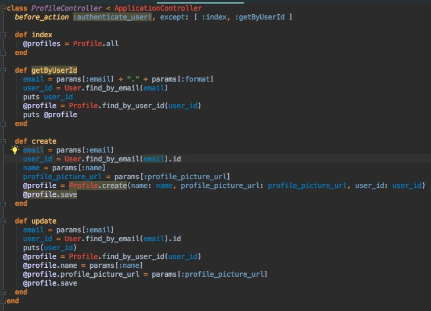

Next, the view engine is invoked and it will render the entire @profile variable. It had the possibility to access this since it has been declared with the '@' sign in front.

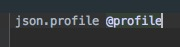

There are multiple ways of defining a model in Ruby on Rails, but one of the most popular ones is leaving the data properties of models in migration files and in the generated schema file, and keeping the validations in the model file. This way it creates a cleaner way of setting up complex validations without having a lot of attributes declared in a file.

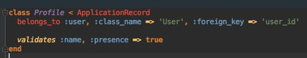

Another important part of the application is Devise, the gem that handles authentication. It does everything from hashing the passwords before storing them in the database, creating and passing around Json Web Tokens and checking the validity and identity of every request. It supports a lot of features like email confirmation, password recovery and social media integration, and in this case it is set up for email authentication, password recovery, tracking of user authentication activity, validation of passwords and emails and social media authentication.

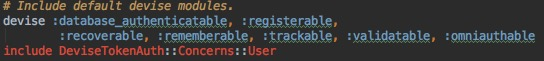

Since this is an API, it will need to support Cross-Origin Resource Sharing, and for this the rack-cors gem is used. What it basically does it attaches some specific Access Control headers to every response so that the browser knows that the application is setup for handling multiple origins for requests.

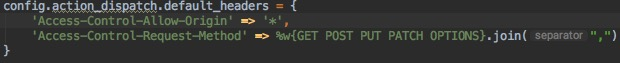

Finally, Jbuilder is used for rendering the views. Rails comes with it setup out of the box, so little to no configuration is required. While there are multiple alternatives to JBuilder, this gem is used since it makes it easy to render complex relations and model the response according to the needs of the client.

### 4.3.2 Database

Ruby on Rails comes with SQLite configured, and for development purposes there is no need to switch to a server absed SQL Database. The schema for this is quite a simple one, but it solves all the needs. At the end of the day, the only purpose of this backend server is to handle authentication and manage the different groups and users belonging to the groups, since no part of the stream will actually pass through this server. Other than the attributes declared in the migrations files themselves, Devise adds a couple columns to the user model, since it would need these for tracking user activity through authentication. Only 4 main tables are required in order to run the application, those being 'users', 'profiles', 'rooms' and 'user_rooms'.

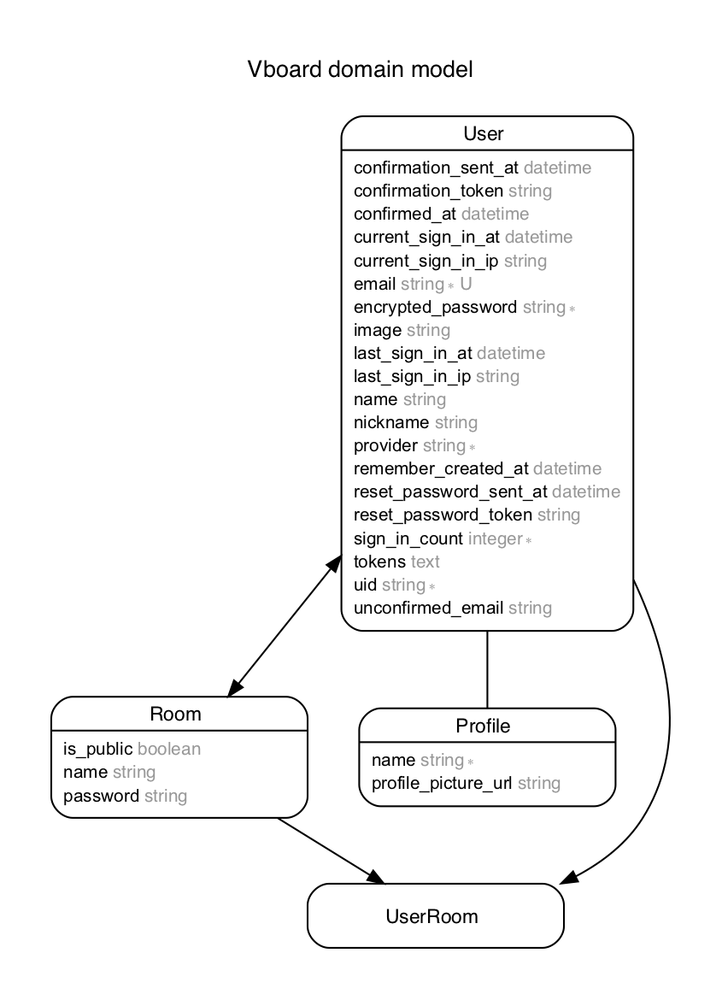

One of the most important features of the entire Ruby in Rails ecosystem combined with Active Record is support for database migrations. They allow you to easily create versions of your database, while also making reverting to older versions a breeze. Each migration is basically a class that has multiple changes defined. They can be from adding tables, removing tables, altering them and even inserting SQL code manually. Another advantage is that unlike other migratino solutions for other languages like Entity Framework, you only really have to define the way the migrations go upwards. This means that you have to define how it will behave going from, let's say 1.1 to 1.2, but if you ever want to revert the migrations, Ruby on Rails will figure out by itself what and how it wants to revert the database. This way it removes user error when manually writing reversion migrations.

For development purposes, seeding the database is also a popular option in order to avoid creating some dummy entities each time you reset the database. Rails offers an easy solution for this in the form of a file called 'seed.rb'. Basically, you only need to define some entities in there, and you can run that file at any time using a simple command line tool. This application automatically generates a couple users, rooms and some links between them in order to make testing a little more easier and staright forward.

The last important thing that Rails and Active Record handle are relations. Since the whole ideology of using migrations is a code-first attitude towards databases, meaning that you should never have to touch the database directly, reltaions are also set directly in the models themselves, without manually having to add foreign keys to databases. Also, Rails can automatically generate join tables for many to many relations, but you can also define your own join tables if more properties are needed. Again, using conventions over configurations, in most relation cases you don't even have to define the property which stores the foreign key ID, since Rails will figure it out itself frmo the naming of the entities.

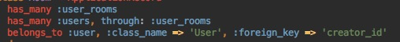

### 4.3.3 Streaming Solution

For the video live streaming part of the application I used a JavaScript library that acts as a wrapper over WebRTC Peer-To-Peer streaming called 'simplepeer'. The way it currently works is once the streamer finished loading his page, the program will start capturing a video stream of the canvas. At the same time, a user will be asled for permission to access the microphone, since the final video may contain an audio track as well. If that permission is granted, the application will attach to the main video track of the stream another audio track containing the recording from the computer's microphone. Afterwards, that stream object will be given to the streaming library to send over the peer connection. The stream is captured at a framerate of 30 frames per second, but that can easily be changed in the future by the user in order to accomodate for slower internet conenctions.

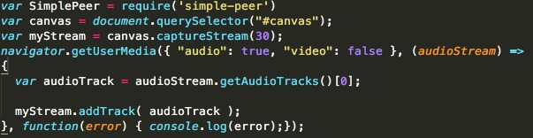

In order ti initially capture the stream, the application has to first find the canvas element on the page, and it currently does that by using its ID. Also, another important aspect to note is that the canvas is forced to re-render its content whenever a peer decides to connect. This has to be done since otherwise the newly connected peer would not see anything until something modified on the streamer's canvas.

Also, this streaming method does support multiple peers. While it wouldn't be recommended to have thousands of users connected to the same stream, having somewhere around 20 to 30 users should not be a problem depending on the streamer's internet connection. The signalling system is built in such a way that whenever a new user wants to view the stream it will not disrupt the other users' watching experience.

Last but not least, a good reason to use such a wrapper library is that it handles connection closures by itself. This way, when a user disconnects, either because of closing the tab or internet issues, the streamer's connection to it will be automatically closed and it will not put extra stress on the internet connection.

### 4.3.4 Web Graphics

In order for the canvas to actually be useful there have to be tools in place for the streamer to draw on it. For this, the application uses a JavaScript library called 'FabricJS' for actually drawing the items on the canvas. While this library does a great job at drawing, the only interaction it has out of the bow is dragging the elements around. So the application has to manually implement the tools for drawing and the way a user would interact with the canvas in order to create the shapes, text and desired images.

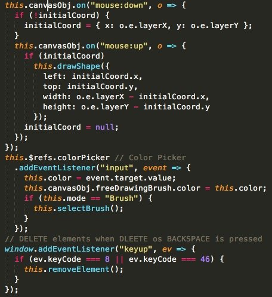

For different mechanics like deleting an object when the delete key is pressed or for click and hold in order to draw a shape the application attaches a series of event listeners to the canvas object. This way, it can intercept the interactions a user makes and convert them to drawn shapes according to the tool selected by the streamer.

Different items require different parameters in order to be created, and another thing to keep in mind is the order of those given parameters. Since you could draw arectangle from left to right or the other way around, the app also keeps track of the direction of the drawn shapes in order to accurately position them on the canvas object. Another thing that needs an event listener is the color picker. This tool allows a user to select different fill colors for shapes or text colors. While it does use the default color picker embedded into most browsers, it still needs to be able to see the dynamic changes in color a user might make without reselecting the tool. This allows you to draw the same shape multiple times with a different color each time without forcing you to reselect the tool after a color change.

There are multiple tools offered to a user in order to allow him to be creative in drawing the items. This first one is a brush tool which allows you to select the color and thickness. Next up is a selection tool, allowing you to select an item for rearranging it on the canvas or to mark it for deletion. 2 of the current supported shapes are rectangles and circles, for which a user can specify the fill color and, in case of the circle, the stroke width. Text is a really essential tool that also provides quite a bit of customization in the form of font size, color and allignment in the drawn container. Also one can create simple straight lines while also specifying the width of the drawn line. The canvas also has support for images, a user having to simply input the URL of the image and that will automatically be added to the canvas. The last 2 items are a deletion tool which works by first selecting the desired item to be deleted and then clicking the appropiate tool and a color picker which controle the color of the element currently being drawn.

### 4.3.5 Serverless Computing

A really important part in the simplicity and server light-weightness is done through serverless computing. Basically, there are 2 main parts of the application that utilize a service provided by Google called 'Firebase Real-Time Database'.

The first of them is the peer signalling. Basically, before the peers can start streaming withtin each other they need to establish a connection and to notify about their existence. First of all, the viewer has to express it's existence. The streamer will automatically detect its presence through firebase's SDK and post an offer. This is automatically picked up by the viewer which validates the offer and sends a response in the same tree hierarchy. Again, the response is automatically signaled to the streamer and it allows the peers to connect and start the video stream. In order for this back-and-forward communication to happen there are some validations that need to be in place, so that the component doesn't necessairly re-render on every change to the node in the database.

Another part of the application that works solely using Firebase is the chat system. Basically, this allows any user in a room to interact with each other by using a chat. Once they connect to the room they will be attached to an event listener in the database. This way, any time a node changes because, for example, some added a new comment, the client will automatically fetch the remaining data in order to be displayed in real time. This approach eliminates the need  for a standalone socket implementation or for server polling. Also, if a user decides it wants to add a new comment, it will trigger the Firebase server to automatically signal all the connected users, this way forcing a refresh of that specific content on every other user connected to the stream.

One of the great parts of using Firebase in conjunction with a regular server with a database is that it simplifies the socket process by a lot. Also, it does relieve a lot of network and processing stress frmo the server, making the costs associated to hosting it smaller.

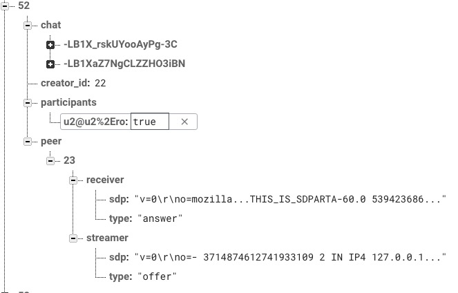

### 4.3.6 UI and Front-End

In order to help with creating a really fast web application, the client uses a library called 'VueJS' for handling UI navigation and not only. It is based on an MVC like model, meaning that it uses templates to render the content and controllers to keep track of the displayd content. Also, it is really lght-weight, allowing for a page to load quickly and not to load unnecessary resources. It allows for a developer to keep components in a single file or split them apart, however he wants, this way making it easier to keep track of variables across views and JavaScript files.

An important part in rendering the content it Vue's templating system. One of the main features it offers is 2 way data binding. Basically, this allows a user to dinamically change a page's content whenever a variable in the controller modifies, but also automatically modify a controller variable whenever a bound input is modified by the user. This allows for a much less verbose communication methos between the 2 main parts of a component than a simpler one way data binding system would offer. Also, certain template directives allow it for easier rendering of elements like lists. By using an attribute like 'v-for', Vue is able to render a list of items from the contrller in the view without needing to generate the HTML code in the JavaScript file. Also, through a key system, it is able to easily figure out which item from a list has been interacted with.

One palce where Vue excels in comparison to other libraries and frameworks is in code organization. Everyting in a JavaScript file has to be split between data items which are variables that can be seen and modified from the view, separate methods for data processing and handling more complicated interactions like routing logic between components and even processed variables which change their value whenever another variable changes, directly or indirectly, throughout the app. All these methods declared like this are accessible to the client through the view if they are tied to an action on an element.

The way Vue handles page rendering and mounting is pretty similar to any other JavaScript framework, and, just like ReactJS it provide a number of lifecycle hooks of a component in order to give you proper control over the flow of data through the component. Some of the most popular lifecycle hooks are created, mounted, updates and destroyed, and this app uses the mounted hook quite often. Basically, any time you would have to do an HTTP request to the server you will render the UI first without loading the data, and then populate it once the data arrives. This will give a user the impression that a website loads faster than if he would have to wait for the data in order for anything to be displayed. Also, there are other initializations that can be done only after the UI has rendered, incresing the responsiveness of the page.

An important part of the components used are rendered using Vuetify. This is basically a JavaScript and CSS library that provides a suite of Material Design components which make the craetion of a design easy and effortless. Other than some pre-styling applied by the library, the greatest advantage of using it is that it also comes with a 12 grid system for creating complicated layouts. These layouts are easy to adapt to being responsive, this way being rendered right both on the desktop and on mobile or tablet. Below is an example on styling between standard HTML components and Vuetify components.

[Material Design]: https://material.io/design/	"Material Design"

Axios is the HTTP Client of choice since it has multiple advatages over an approach using just the standard fetch API. While the fetch API can basically do any type of request you might need, it does it in a much more verbose way than AXIOS. Also, AXIOS introduces some interceptors for HTTP requests allowing you to modify headers of any incoming or outgoing request. All in all, it provides an easier and more concise way of interacting with the data on a server.

A key part of the application is Firebase as we mentioned before, and since only the client ever gets to interact with it, it needs a complete suite of actions to match. While Firebase does provide an API-like approach giving you endpoints for all your data, a better way of retrieving and writing data into the real-time database is by using their SDK in the form of a JavaScript library. Also, a crucial feature of this app is being able to automatically listen to events triggered in the database and for that using the SDK is the only real viable option. In order to use the SDK a developer needs to go to the Firebase console and create a new project. After setting the database access rules you are able to get all the configuration parameters needed in order for the application to estaclish contact with the cloud hosted database.

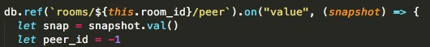

Routing is a really important but basic part of the web platform. In a way, it provides functionality that a user might take as a given, but on the code side of things it handles not only navigationg between components but authentication as well. The officially supported router for VueJS is vue-router, and that is also the one used here. In order to setup the routes the application uses a matching pattern to match the URL with one of the configured ones and it renders the appropriate component depending on the match. It also supports wildcards, this way, for example you can redirect any navigation that is unknown like an undefined URL to a certain page like Home. Besides serving these purposes, keeping an unauthentificated user out of places where he shouldn't be is a key responsability. For this, at every navigation, before entering the next component, the router checks if a user is authenticated before letting him in. In some cases, it might redirect the user to the login page in case his JSON Web Token is invalid. This is how it is able to decide which user can access what part of the page and redirect unauthorized ones to public zones of the application.

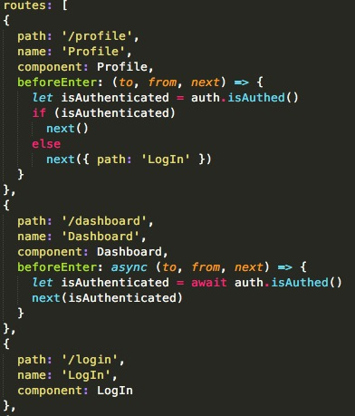

The last essential link in the authentication chain is done through localStorage. The way devise authentication was configured on the server is this: Forst of all, a user signs in and the back-end server generates a token. For the next request, the client will need to include the previously generated token in the headers of the request. When returning, other than giving back the requested data, the server will also issue a new token which the client will again have to memorize and attach to the next request. This creates a really secure chain of events but adds a little complexity to handling the tokens on the client side. Basically, the token chages and the client has to keep track of the latest issued one. While it could be kept in memory, the problem is that would force the user to login every single time he closes the tab. While it works great from a security standpoint, frmo a user experience perspective it's really bad. For this, the browser has to store locally the current token. In order to do this it uses an HTML5 API called localStorage which allows him to store it locally on the client's computer. Despite being stored on the computer, the JSON string that is being stored can only be accessed from the domain it has been set. This way, a website like 'www.facebook.com' can not access the locally stored items of a website like 'www.vboard.com', helping to mitigate session hijacking.

On the styling part of the UI, while Vuetify handles a lot of the basic work, there are always adjustments which will require manually writing some CSS code. While CSS is not inherently bad, it can easily be enhanced by using SCSS, a language that is interpretted and convert into standard CSS. One of the things this adds are variables and rule nesting. Variables are an easy way to keep track of things like colors throughout CSS code, this way even making theming easier. On the other hand, rule nesting is a life saver when having to write long CSS rules and also the fact that any CSS syntax is valid SCSS makes it a really easy transition especially for designers. Here is an exmaple of the differences:

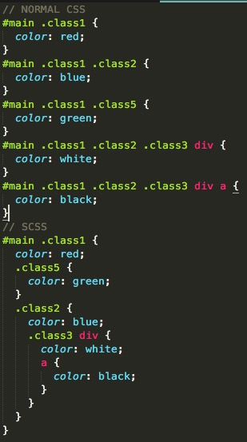

The last thing making the development much more pleasant throughout the application is the use of features from the EcmaScript 6 Standard. Things like constants, arrow functions and async/await make programming for the front-end much more pleasing. For starters, the 'const' keyword allows you to define a variable which cannot be directly modified in code, this way making sure that other unexpected pieces of code do not modify its value. Next up, arrow functions, other then being easier to read and follow, remove the need to bind the 'this' context. In the past, handling this context was a nightmare in JavaScript and you would have to manually do bindings, but by using arrow functions the 'this' context is transmitted automatically without any developer intervention. Last but not least is the 'async/await' syntax. What it basically allows is to treat asynchronous code as synchronous code. This way you eliminate most of the promises throughout the app and the so-called 'callback hell' where you had to nest multiple promises in order to be able to define a clear order of execution of multiple async functions like API calls. While all calls to the API are made using this syntax, the calls to the Firebase Real-Time Database are still ahndled with promises since they don't use a standard HTTP architecture, but more of a socket-like interface combined with event listeners.

[ES6]: http://es6-features.org/#Constants	"Ecma Script 6"

## 4.4 Validation and Testing

Testing is a crucial part of developing an application since it helps write more bug-free code frmo the beginning. In order to do this there are some tests implemented for Ruby on Rails. Rails has a gem called 'test_helper' used for writing integration tests.

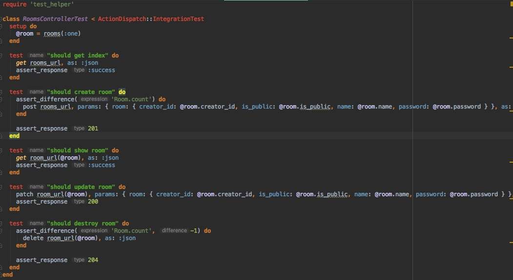

This suite helps a developer test anything from methods, controller actions and request handling. You can automatically simulate HTTP requests towards the API and assess the results of that specific call. Since it comes out of the box with Ruby on Rails it features a great integration with the entire ecosystem.

Another thing that helps manual testing is seed data. Especially during the early stages of development, the database might me redone multiple times and a lot of the times data will be lost while testing. While that si not a problem during testing, having to constantly manually create new entities can be tedious and time consuming. In order to automate this process, Ruby on Rails provide a way to automatically generate entities in the database by using one file and a command. The file stores the ActiveRecord instruction for seeding like the entities to be added and addition logic. In our case, the seed method checks if there are already existing elements of a certain type in the database. before adding new ones in order to not get duplicate names. After this initial check it automatically creates and saves these entities just like it would if those actions would be performed in a controller. This file can only be written once and it can be run at any time using the 'rake db:seed' command.

Last but not least, the Rails console is a really valuable addition to the entire ecosystem. Even in the controllers, at the end of the day, every action simply executes some lines of Ruby code and ActiveRecord commands. The console allows you to do this same thing dinamically, sort of like a broswer console might allow you this for JavaScript. This is a great way to initially test your database queries and CRUD (create-read-update-delete) operations. You can see the results of your queries instantly in the console and even save things directly into the database. Basically, it creates a simulated environment where it allows the developer to play around in order to find the best and most efficient queries.

## 4.5 Personal Contribution

This sub-chapter has the purpose of detailing the personal contribution added to the project. We will start with the back-end side of the project and finish with the UI of the application.

So, first of all, the back-end server. While the base structure of the project was generated using the Rails command line tools, I personally had to create the structure of the entities, models and validations and the Database queries. All those parts had to be joined in the controllers and create the entire back-end logic from scratch. Also, manually configuring the project from Cross-Origin Resource Sharing to the security of the platform had to be implemented from scratch. Next, as fas as the Firebase storage goes, I had to create a project and figure out the structure of that Database and how it could relate to the Rails database. Especially in NOSQL databases, having a well defined structure can help a lot in future development and in avoiding critical bugs. Also, while the CRUD(Create-Read-Update-Delete) operations on the server do not have to be implemented by hand, the interaction with it form the client does. So every listener for changes and modification logic has to be implemented from scratch. A good example of this is the Peer signaling, where clients have to listen for certain specific events in a certain order for them to properly establish a valid communication channel using WebRTC.

Speaking of WebRTC, I had to implement the streaming logic and the way peers connect to each other. Getting the stream is also an easy task, the HTML5 API providing an easy way to get such a media object. That object had to be manipulated in order to support additional audio tracks for having the auditive part as well.

We come to the graphics part, where every single tool and  interaction had to be implemented form scratch. Every event listener and mouse handling logic had to be implemented separately. Also, handling the parameters for the shape drawing library is done manually since they might change without the used tool actually changing.

This is all implemented as a part of the UI made in VueJS. For this, the canvas part is a self-sustaining component in itself. This way it allows for easy modifications down the line where if other technologies or implementations appear they could easily swap the current approach by simply modifying a Vue file. Other elements also share this component-based approach like the chat, is also being it's own standalone component. The client is set up as a Single Page Application and in order for a good user experience I had to implement routing between components. When doing this I always had to keep in mind what components are publicly accessible and which require a certain authentication state. Also, all the rendering and logic together with UI interactions were implemented from scratch in VueJS.

Also, while the base design of the components are done using Vuetify, the layout and structuring of the HTML page was done without the use of a pre-determined template.

In a nutshell, while the platform does use plenty of libraries and gems as wrappers over lower level technologies, they all still require plenty of modification and coding in order to get them all to work together.

# 5. Conclusion

This chapter goes through a brief conclusion on how the problem was solved using the above technologies and approaches.

First of all, the problem of platform compatibility is solved by using a web only approach. Everything is done through a web application that requires no extra plug-ins or extensions. While the Peer-to-Peer streaming solution is a new web standard that hasn't yet been adopted by all browsers, the major ones like Google Chrome and Mozilla Firefox do have it working reliably. Since every interaction is based on the HTML5 standard, basically any device, be it desktop, laptop, phone or tablet could theoretically make use of the application. While drawing on a phone might not offer an optimal experience, any browser that has support for HTML video should be able to display an incoming stream.

Also, another problem this application solves is server cost. The thing is, the Rails server does not need a lot of data in order to function properly, so server costs are low. Also, Firebase might become a cost if the user base grows but again, not much data needs to be stored there so that might happen only over time and incrementally. The big problem that is solved is a server cost associated to streaming. Up until recently, the only way to do streaming was through an intermediary server. With the peer-to-peer approach we can basically eliminate it entirely, reducing these costs to 0. Even as far as a user data consumption is concerned, the WebRTC standard offers great compression and is really well optimized for video streaming so it should really not consume much data. At the end of the day, all these new technologies and standards could help a company keep the cost low, and by this automatically lowering the price of the platform for the end user.

Last but not least, libraries like VueJS allows for easy maintainability and code swapping. If one part of the product becomes deprecated or there do exist better alternatives, the only required modifications are to the specific component encapsulating that feature. Code reusability is also encouraged by using high-order and dumb components, allowing for example to use the exact same chat component both in the streamer's view and in the watcher's view, without the need to write it multiple times.

# Bibliography

To be continued
