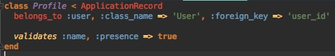

BABES-BOLYAI UNIVERSITY CLUJ-NAPOCA

FACULTY OF MATHEMATICS AND COMPUTER SCIENCE

COMPUTER SCIENCE, ENGLISH

DIPLOMA THESIS

Virtual Boards and Server-less Streaming

Supervisor:

Bogdan Pop

Author:

Tudor Filip Stupariu

2018

---

# Abstract

This paper presents a concept platform that allows its users to create different rooms, public or private, and create content via graphics and text. Next, the content is transmitted in real time to other users via a video stream capturing the graphics being drawn. The platform also allows for users to comment in real time using a chat system. The platform consists of a web application based on an API created in Ruby on Rails and a front-end client based on VueJS.

This paper is structured as follows. Chapter 1 provides an introduction, the motive behind creating this application and why this solution is needed. Chapter 2 presents some current possible solutions to the problem described in Chapter 1, and analyses their issues and faults. Chapter 3 goes through the main solutions introduced by the application and why they are superior to current solutions. Chapter 4 presents the application in details, both from a theoretical aspect and from a practical aspect, also providing samples of code throughout. Chapter 5 brings a conclusion and a short summary of the solution presented, while Chapter 6 contains the bibliography and inspiration used for the paper.

# CONTENTS

1. Introduction

   1.1 Problem definition

   	1.2 Web based graphics and server-less streaming
   	
   	1.3 General description and personal contribution

2. Current Theoretical Approaches

   2.1 Graphics and virtual boards

   	2.2 Streaming approaches
   	
   	2.3 Problems with current solutions
   	
   	2.4 Solution to the problems

3. Benefits of proposed solution

4. Application details

   4.1 Functionalities

   	4.2 Design
   	
   		4.2.1 Backend Server
   	
   		4.2.2 Database
   	
   		4.2.3 Streaming Solution
   	
   		4.2.4 Web Graphics
   	
   		4.2.5 Serverless Computing
   	
   		4.2.6 UI and Front-end
   	
   	4.3 Implementation
   	
   		4.1.1 Backend Server
   	
   		4.3.2 Database
   	
   		4.3.3 Streaming Solution
   	
   		4.3.4 Web Graphics
   	
   		4.3.5 Serverless Computing
   	
   		4.3.6 UI and Front-end
   	
   	4.4 Validation and Testing
   	
   	4.5 Personal Contribution

5. Conclusion

6. Bibliography

# 1. Introduction

This chapter is aimed at providing a short inside of the problem this platform is trying to solve and how/why it's doing things the way it currently is implemented.

This paper is structured as follows. Chapter 1 provides an introduction, the motive behind creating this application and why this solution is needed. Chapter 2 presents some current possible solutions to the problem described in Chapter 1, and analyses their issues and faults. Chapter 3 goes through the main solutions introduced by the application and why they are superior to current solutions. Chapter 4 presents the application in details, both from a theoretical aspect and from a practical aspect, also providing samples of code throughout. Chapter 5 brings a conclusion and a short summary of the solution presented, while Chapter 6 contains the bibliography and inspiration used for the paper.

## 1.1 Problem Definition

Collaboration and remote teaching tools have existed for a ling time, but they have always been platform dependent or hard to use. A lot of what we're doing on a day to day basis is on the internet, so it was just a matter of time until collaboration tools would go to a web only approach. The problem of drawing graphics on the web has always existed and solutions have been around like Adobe Flash, but they were not always reliable and lately they have been lacking support. Since the introduction of HTML5, a new element was added called "canvas" and along with it an API you can interact with using JavaScript.

Another problem has been streaming while keeping costs low. Big platforms like Twitch have been doing it using intermidiate servers to handle the stream data and distribution, but for small groups of people this is a really costly solution, since the processing power required by the servers in incredibly high.

Combining the two, remote learning and teaching has always been a bit of a challenge, and this platform aims to make it easy to use and integrate seamlessly in the day-to-day life of its users, while also providing enough tools for someone to manage to be productive using the app.

## 1.2 Web Based Graphics and Serverless Streaming

Drawing graphics on the web isn't really a challenge anymore, the problem comes when you have to add user interaction. Just displaying shapes has always been decently easy, but making a user dynamically draw shapes is not the easiest of tasks. Also, former solutions involved plugins which some users may not have installed or it may confuse a user about why the platform does not seem to work. This solution provides a general solution using a standard provided by HTML itself.

Serverless streaming, or peer-to-peer streaming is also a new idea on the web. P2P file transfers have existed for a long time, but just recently there has been introduced a standard for managing such connections that also support data, video and audio streams in the form of WebRTC P2P streaming. This is a standard/API that can easily be accessed by JavaScript on the web, providing a general solution for any user on any platform, without requiring extra plun-ins or intermediate servers ti handle tha data, which might introduce more latency in the stream feed.

## 1.3 General Description and Personal Contribution

This application provides a simple to use web client accessible by any user through a web browser. It provides authentication in order to keep the platform secure, and allows the user to create both public and password protected private groups. Once in a group, the initiator can start the stream, while the other attendees can start watching a video feed. The initiator has a canvas on which he can freely draw graphics, text, images and shaped and that information is transmitted live through the video feed. It also provides a form of live interaction through a chat, so that the attendees can freely ask questions or leave comments.

I have personally developed the API for the web client and implemented the authentication, database structure and back-end logic. Also, I created the web client and layout of the interface. The logic behing signalling peers and live chat has been implemented from scratch, as well as all the tools for drawing on the canvas combined with the user interaction with these tools.

# 2. Current Theoretical Approaches 

This chapter describes the most used current approaches to the problem. It also goes a little bit into each approach and it's downsides for our goal of achieving a low cost and easy to use streaming and drawing learning platform.

## 2.1 Graphics and virtual boards

Currently, there are multiple other approaches for drawing on a blank canvas on the web, without the need for native clients. Some of these include SVG graphics and Flash drawing.

SVG graphics work pretty well performance-wise. Also, since they are vector graphics, they scale really well. The problem is, we don't only want to display graphics, but we want a user to be able to create them. And here, the tooling with SVG gets a little trickier. The handling of shapes, text or other types of primitive graphics is harder to implement and doesn't make too much sense in an environment like SVG.

The other option would be Flash, but the problem is that it is an old technology that a started to lack support in the recent years. First, you do need a plugin for running flash applications, which makes it much less user friendly. Also, Adobe, the company offering the support for this technology, said they would drop support of it by the year 2020 [https://support.google.com/chrome/answer/6258784?co=GENIE.Platform%3DDesktop&hl=en]. 

## 2.2 Streaming Approaches

Streaming in general is an action that requires a lot of resources, both computational and network ones. Traditionally, streaming has been done through standalone servers user exactly for that purpose. Whlie they do produce decent scalability for a big number of concurrent users trying to watch a stream, they also introduce a couple problems, the main one being cost. Since it is a resource hungry activity, the server cost is really high. This way, mantainance and scalability can be quite costly. Also, since this application is made for small rooms of people, it will not directly benefit from the ability to handle a great amount of users watching a stream at the same time.

## 2.3 Problems with current solutions

Current solutions are either too old, cumbersome or expensive to implement and mantain. Server resources are expensive, and the more processing that can be done on the client, the cheaper the mantainance cost of the application will be. Having more servers and nodes that a stream has to pass through can also introduce more latency laong the line. Also, making the user interaction as straight-forward as possible is not so wasy using these technologies.

## 2.4 Solutions to the problems

Each problem has a solution, starting with the graphics. During the launch of HTML5, a new element and API was introduces called Canvas. It offers you a place that does not rely on a DOM for creating graphics. It also needs no other external tool or extension, the interaction and drawing being done solely reliant on Javascript. It's main advantages are ease of use and the effortless user interaction it can provide. Also, this API offers an easy way to capture a video stream of the actions and graphics being drawn.

For the streaming part, the solution for expensive server resources is eliminating servers all together. WebRtc P2P video streaming is a technology optimized for streaming data, including video, between multiple peers directly. This way, the system only needs a server for signalling clients when a connection offer is coming, but no actual video stream data passes through it. The connection for the video stream is made directly between the 2 clients' browsers, minimizing the server resources needed.

# 3. Benefits of proposed solution

This chapter a few of the benefits introduced by the proposed solution that help solve the problems mentioned before.

First of all, the server API is made with technologies which are really fast to develop and implement. Ruby on Rails is a really good environment for developing applications quickly without too much hastle. Second, the JavaScript library used is VueJS, which provides huge amounts of customizability and speed, rendering only the parts it needs in a single page application form. Firebase allows for easy communication using sockets and the canvasa and WebRTC protocols allow for a cross-platform solution that works in all browsers, from desktop to mobile platforms, allowing all types of users to watch video streams.

# 4. Application Details 

This chapter goes in depth into describind the applications and all the core components that make the while platform work the way it should.

## 4.1 Functionalities 

This first thing a user sees when going onto the platform is a login screen where he can create/sign into an already existing account. This is the only way to use tha platform and confirm his identity, through a secure authentication form. 

Next, a user has 2 options. Either browse the already existing rooms, or create his own. In case he wants to create one, there's a simple form where he has to input some details, and if he wants to make a private room, he also has to set a password. Afterwards, he will be riderected to that specific room's page. In case he wants to join an existing room, he has to browse to his preferred one, and click to join. If the room is private, he'll be required to input the password corresponding to that room.

Afterwards, if he is the creator, he'll be able to go to the actual creation page, where he'll have tha canvas and a chat. If he's an attendee, he'll be redirected to the view page containing the stream video and the chat.

As an owner, the canvas will have several tools, from shape drawing to image insertion and text. As a viewer, you'll have your basic video controls like play/pause.

All parties have unlimited access to the chat which runs along in real time with the stream, allowing seamless interaction.

## 4.2 Design

This sub chapter describes the theoretical aspects and the tools used for creating the application.

### 4.2.1 Back-end Server

The language used for handling all the back-end logic is Ruby, in conjunction with the Rails framework. It works as a stand alone API, allowing for future integration with mobile, desktop or any other type of client. Ruby is a dynamic, interpreted, reflective, object-oriented programming language designed and developed in the 1990s. While it can work as a standalone programming language, it's popularity has really grown with the rise of Rails, a framework for easy and rapid development of web applications. The current iteration of Ruby used in this project is Ruby 2.3.3, while Rails' version is 5.1.4 . Rails is a server-side web application framework that uses a general MVC pattern for data transmission.

The way Ruby on Rails uses MVC in this project is as follows: The model properties are being defined in migrations, while different limitations and validations on those properties are done into their own file. Using these models that automatically map to the tables in the database using the Active Record pattern, the controller receives all inbound HTTP requests and handles tha data, later returning that data to the view in JSON format.

The mapping between the controller actions and the HTTP requests is done using a routing module that redirects every inbound request to its corresponding controller method. This application uses a combination of GET and POST requests in order to handle all CRUD (Create-Read-Update-Delete) operations.

Authentication is another point being handled by the server. The application uses a gem called devise-jwt, allowing for easy authentication using JSON Web Tokens. This provides a really adaptable authentication scheme, being able to wokr on the web, mobile, desktop, and virtually any platform a client would be on. The passwords are hashed and salted when stored in the database, so that at no time the application knows the actual credentials of a user. This module also allows for future expansion, supporting social media authentication using Google, Facebook or other providers. 

The transfer of data from the server is done through views which contain JSON strings. These strings are rendered using a gem called Jbuilder. Jbuilder gives a user a simple DSL for declaring JSON structures, coming in handy especially in places where you are working with big and complicated data structures. It can loop through your structure and create a dynamic model for transmitting the data. 

This being an API, it has to be able to support CORS (Cross-Origin Resource Sharing). Without it, a web app could not work in browsers like chrome, since the server and the client would not be on the same server. The gem rack-cors allows you to easily enable this functionality through header alteration, while also making it easy to restrict to certain domains.

###4.2.2 Database

The application currently uses a simple file-based database called SQLite. It is ideal for development, since setup takes virtually no time at all, especially since Rails uses it as a default database. SQLite is a relational database management system contained in the C language. It being embedded in the application itself, without the need of a server has both advantages and disadvantages. The bad part is that the size of it can grow quickly and can become a burden for your back-end server. On the bright side, it is really portable, easy to setup and makes for a great tool during the development process.

One big advantage of Rails is that it makes it painless to migrate to another relational database system. It uses an abstraction layer over your database so that you never have to manually write SQL queries or modify tables. If you decide to switch to another database system like PostgreSQL you simply have to modify a couple configuration files. The abstraction layer is called Active Record and it is based on a pattern carrying the same name. In a nutshell, what it does is it maps every single table to an entity that is globally available throughout the application controllers, this way also removing the need for separate repositories.

Another big helper flexibility-wise are ActiveRecord Migrations. They provide a code-first database building workflow which allows you do gradually modify the database and provides an easy way of reverting back to older versions of the database. Also, you do not have to manually migrate databases from computer to computer, making the database creation and seeding just a terminal command away. 

###4.2.3 Streaming Solution

In order for the app to allow a user to stream the content of a canvas it uses a streaming standard called WebRTC. WebRTC is an open source project aimed to provide browsers and mobile applications an easy access to Real Time Communication capabilities via APIs. The part of this technology used by this application is Peer-To-Peer Video Streaming, allowing video streams between users without the data needing to pass through intermediary servers. How it currently works is that the peers are creating a unique id, then using a simple signaling server made for letting peers know about each other it makes the connection between clients and starts the video stream. Current supported platforms include Google Chrome, Firefox, Opera, Android and IOS, but many more browsers seek to adopt it. Also, this technology is optimized for data streams, this way keeping a smaller footprint on your network traffic while keeping the stream quality high.

The application also uses a wrapper over this standard in the form of a JavaScript library called simple-peer. This provides a simpler to use API for communicating between peers and a default server for the peers to get their unique ids. This wrapper supports both data streams and video/voice streams.

###4.2.4 Web Graphics

A user has to be able to draw things somewhere in order to stream them, and in order to do that it will be using an HTML Canvas element. This element exposes an API that can be interpretted with JavaScript, allowing a user to draw or write on a virtual board.

Rather than using the native API, the application uses a wrapper for drawing certain types of shapes, text or images. FabricJS is a library made for displaying graphics easier on a canvas element. It also allows setting different behaviors of elements like drag and drop or rotation. The difference between this and the lower level API a Canvas element provides is that it abstracts all the elements into an object-oriented style. This way, anything you draw will become a simple JavaScript object with properties, allowing for easier management and drawing of graphics.

While FabricJS does provide a more intuitive way of drawing and manipulation objects in an image, the actual process of defining where to draw items on a canvas has to baa handled separately. Currently it is done using a combination of JavaScript event handlers for figuring out the state of the mouse on a canvas. This way, it can easily detect when a user clicks, drags or holds an element and react accordingly while drawing the shapes. All the mechanics for drawing had to be implemented from scratch since they need to be really customizable dependent on what the drawn item is.

Also, in order to get a stream from the Canvas element, the application uses an HTML5 API called captureVideoStream. This allows you to set a target framerate to capture depending on your internet connection and requirements and pass it onwards to the WebRTC connection in order to be streamed onwards. Also, it combines an audio feed from the microphone, so that users can also hear explanations offered by a teacher.

### 4.2.5 Serverless Computing

Some of the features provided are available using a technology called Firebase. To name them exactly, the Chat and the Signalling Server are both made using the Firebase Real-Time Database. The Firebase Real time Database is a database hosted in the cloud that stores information in JSON format. Being Real-Time, it constantly synchronizes with other connected clients using sockets and event listeners.

For the application chat, this technology is useful since you don't have to implement a socket interface from scratch. Also, all communications are done without using the server, just Firebase. By attaching an event listener to certain nodes of the JSON structure, a client is automatically notified of a change if another client decides to alter the structure of that node or the nodes below.

Firebase also comes into help for peer signaling. In order for 2 clients to connect and establish the stream, they need to first know about each other and accept each other's offers. For this, there is a certain sequence to follow starting from the initiator of the stream, and Firebase allows clients to automatically be notified when an offer or answer is present and react according to that. This eliminates the need for implementing a socket interface or for HTTP polling, making the connection easier and faster.

### 4.2.6 UI and Front-End

The client of the application is web based and uses a library called VueJS, it being an open-source JavaScript framework for building user interfaces. 

**vuetify + grid

**axios

**routing and guards + localstorage

**scss

